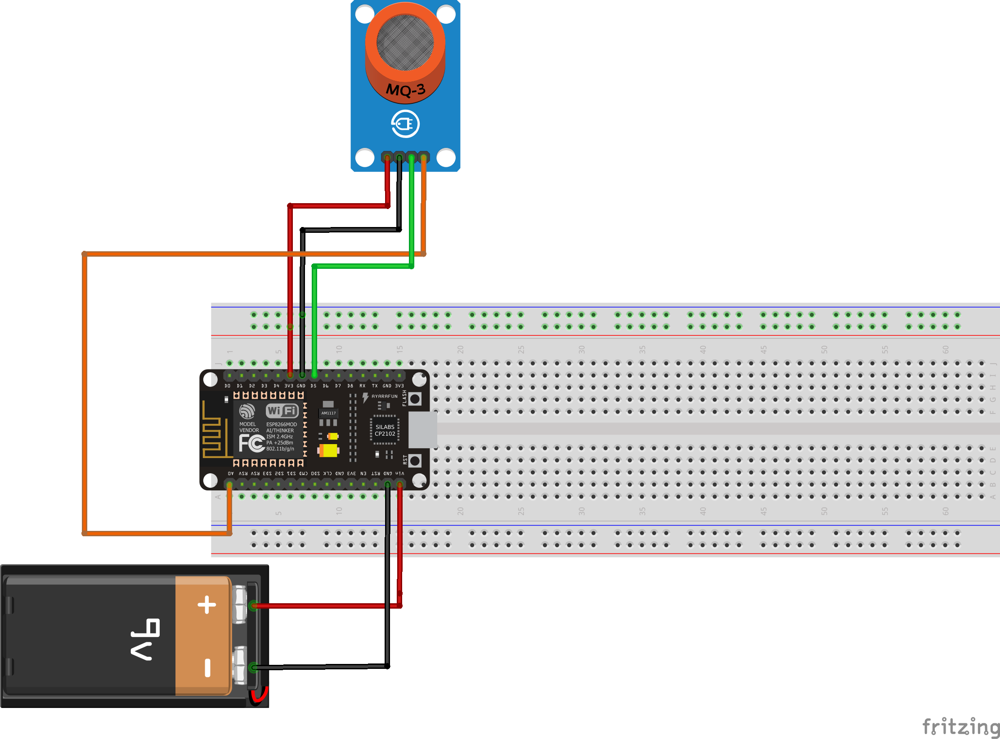

# AgriSmart-Greenhouse-Gas-Analyzer
# 🧪 AgriSmart Gas Analyzer

The **AgriSmart Gas Analyzer** is an Internet of Things (IoT) solution developed to monitor **air quality** inside greenhouse environments. It is part of the AgriSmart ecosystem, which includes the Weather Station and Irrigation System. This analyzer focuses on detecting **harmful gases** such as **ammonia (NH₃)** and **carbon dioxide (CO₂)** to ensure a safe and healthy atmosphere for both plants and greenhouse workers.
<h3 align="center">🔧 AgriSmart Gas analyzer 🧪 </h3>

  

---

## 🌟 Features

- 📡 Real-time gas monitoring via **NodeMCU (ESP8266)**
- 🧠 Integration with **Blynk IoT App** for live remote monitoring
- 🚨 Early warning alerts for harmful gas concentrations
- 📊 Data visualization via smartphone dashboard
- 🖥️ On-device LCD for local feedback

---

## 🔍 What It Does

- Continuously measures **air quality** using the **MQ135 gas sensor**
- Detects dangerous levels of **ammonia, CO₂**, and other pollutants
- Sends readings to the **Blynk app**
- Displays gas levels on an **LCD screen**
- Helps maintain a safe and productive greenhouse environment

<h3 align="center">🔧 AgriSmart  Gas📱 Mobile App Dashboard
 </h3>

  

---

## 🧰 Components Used

| Component             | Description                                 |
|----------------------|---------------------------------------------|
| NodeMCU (ESP8266)    | Main microcontroller with Wi-Fi capability  |
| MQ135 Gas Sensor     | Detects various harmful gases               |
| 16x2 LCD Display      | Shows real-time gas levels                  |
| Buzzer (optional)    | Audio alert for dangerous gas levels        |
| Blynk App            | Mobile interface for remote monitoring      |
| Jumper Wires         | For connections                            |
| Breadboard           | For prototyping                            |

---

## ⚙️ How It Works

1. The **MQ135 sensor** reads gas concentrations from the surrounding air.
2. The **NodeMCU** processes the data and sends it to the **Blynk app**.
3. The **LCD display** shows current gas levels for local observation.
4. If harmful gas levels are detected, the system can trigger a buzzer or send alerts via the app.

---

## 🖼️ Project Images

<h3 align="center">🔧 AgriSmart  Gas Analyzer📱 🔧 Schematic Diagram
 </h3>

  

